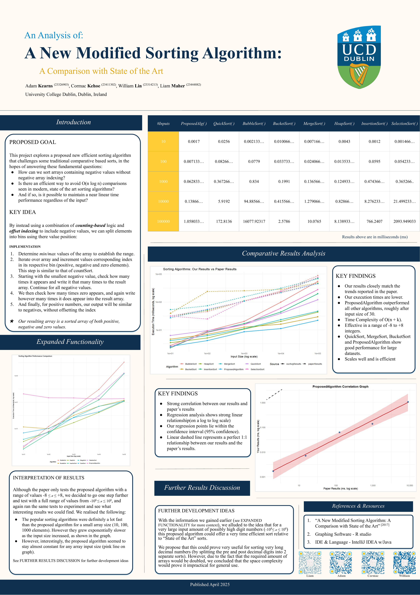
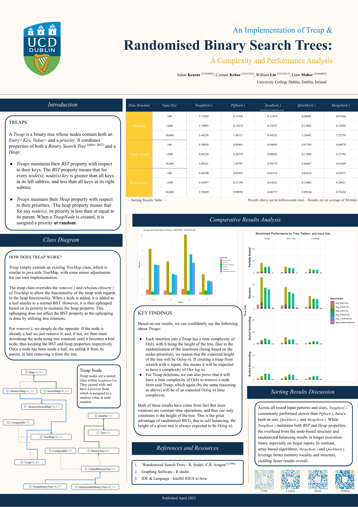

# Treap Implementation & Novel Sorting Algorithm

College coursework from UCD covering two related modules: **Algorithms** and **Data
Structures (COMP20280)**. Both projects centre on sorting and search-tree performance,
and were completed as part of the same team assignment sequence.

## Posters

<table>
<tr>
<td width="50%">

**Algorithms module** — proposed sorting algorithm vs. classic baselines



</td>
<td width="50%">

**Data Structures module** — Treap vs. AVLTreeMap / TreeMap



</td>
</tr>
</table>

## Contents

```
Algorithms/                              Algorithms module: proposed sorting algorithm project
  Algorithms_Module_Project_Description.pdf   Assignment brief
  Algorithms Project Report.pdf               Final report
  Algorithms Poster.pdf                       Poster presentation
  Algorithms-main/                            Java source + benchmark results

Datastructures/                          COMP20280 Data Structures: Treap assignment
  COMP20280_Assignment_I_2024_25.pdf          Assignment brief
  DataStructures_Project_Report.pdf           Final report
  DataStructures_Poster.pdf                   Poster presentation
  final_treap_benchmark_results.csv           Treap vs. AVLTreeMap vs. TreeMap benchmark data
  sorting_benchmarks.csv                      TreapSort vs. other sorting algorithm benchmark data
  treap-implementation/                       My Treap source code (see note below)

docs/posters/                            Poster images shown above, for the README
```

## Algorithms module

The brief (`Algorithms/Algorithms_Module_Project_Description.pdf`) assigned each team a
research paper and asked us to implement the algorithm it proposed, then reproduce the
paper's performance comparisons against the classic baseline algorithms it was benchmarked
against.

`Algorithms/Algorithms-main/` contains the Java implementation:

- `SortingAlgorithm.java` — common interface all algorithms implement, used for benchmarking
- `BubbleSort.java`, `InsertionSort.java`, `SelectionSort.java`, `MergeSort.java`,
  `QuickSort.java`, `HeapSort.java`, `BucketSort.java` — baseline algorithms from the paper
- `ProposedAlgorithm.java` — our implementation of the algorithm proposed in the assigned
  paper (a counting-sort-based approach that partitions negative, zero, and positive values)
- `Main.java` — runs every algorithm across a range of input sizes and trial counts, writing
  timing results out to CSV

To run it: set the input sizes in `testSizes[]`, the number of trials in `TRIALS`, and the
output filename in `Main.java`, then compile and run `Main.java`. The `*.csv` files in this
folder are the benchmark results produced by earlier runs.

Full writeup and results are in `Algorithms Project Report.pdf`; `Algorithms Poster.pdf` is
the poster presented at the module's poster session.

## Data Structures module (COMP20280 Assignment I)

The brief (`Datastructures/COMP20280_Assignment_I_2024_25.pdf`) asked each team member to
individually implement a **Treap** (Seidel & Aragon, 1996) — a randomised, self-balancing
binary search tree that keeps balance probabilistically using a random priority on each
node — and then, as a team:

1. Benchmark Treap insertion, search, deletion, and in-order traversal against a
   hand-written `AVLTreeMap` and Java's built-in `java.util.TreeMap`, across input sizes
   from 100 to 10,000 and across random, sorted, reverse-sorted, and partially-sorted data.
2. Implement **TreapSort** (insert into a Treap, read back via in-order traversal) and
   benchmark it against `PQSort`, `Collections.sort()` (TimSort), and the team's own Quick
   Sort and Merge Sort from the Algorithms module.

`final_treap_benchmark_results.csv` and `sorting_benchmarks.csv` are the raw results from
those two benchmarks. `DataStructures_Project_Report.pdf` covers how the Treap works, our
design decisions, and the performance analysis; `DataStructures_Poster.pdf` is the poster
from the April poster session.

### About `treap-implementation/`

The assignment required each team member to implement their own Treap individually and
push it to a personal repository under the module's GitHub Classroom organisation ("code
implementations, committed to github" was graded per-person). My original submission lives
in a private GitHub Classroom repo tied to my UCD account, which isn't reachable from a
regular, non-university GitHub account — so it's copied in here instead, under
`Datastructures/treap-implementation/`, for anyone who wants to see the actual code
alongside the report and poster.

It's a small data-structures course library built up over the semester, not a from-scratch
repo — most of the `src/` folder (lists, stacks, queues, hash tables, the base `TreeMap`,
`AVLTreeMap`, etc.) is coursework infrastructure from earlier in COMP20280 that the Treap
assignment builds on top of. The pieces specific to this assignment are:

- `src/tree/Treap.java` — the Treap itself, extending the course's `TreeMap`
- `src/tree/TreapBinaryTree.java` — the underlying tree structure, extending
  `BalanceableBinaryTree`, with a `TreapNode` that carries a random priority
- `src/tree/TreapAdapter.java` — adapter used for benchmarking against the other maps
- `src/tree/TreapSort.java` — the TreapSort algorithm (insert into a Treap, drain via
  in-order traversal)
- `src/tree/TreapBenchmark.java` and `src/tree/SortingBenchmark.java` — the benchmark
  harnesses that produced `treap_benchmark_results.csv` / `sorting_benchmarks.csv`
- `src/tree/TreapTest.java` — unit tests covering the Treap's operations

## About this repository

This repo brings together final deliverables (reports, posters, benchmark data, and source
code) from both modules in one place for reference — it wasn't originally maintained on
GitHub during the course itself.
